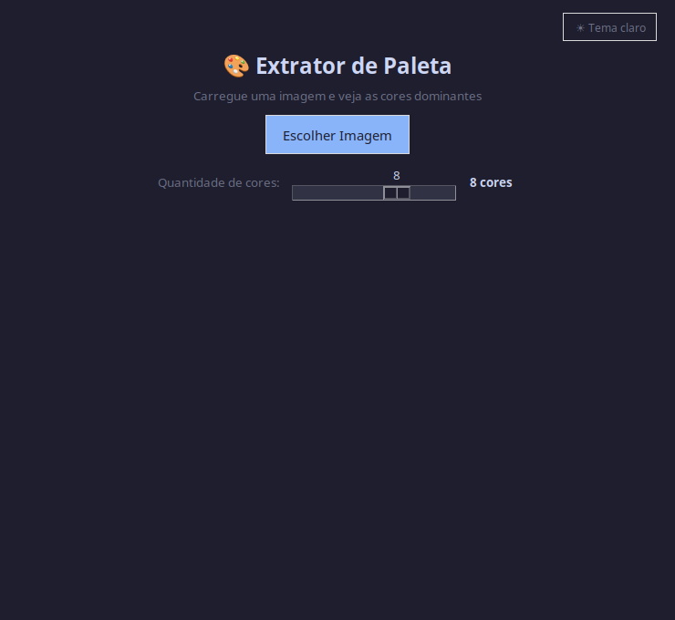
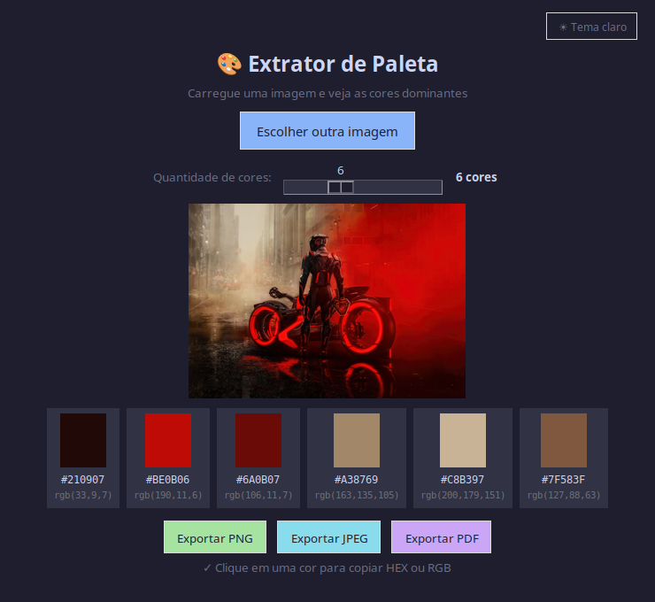
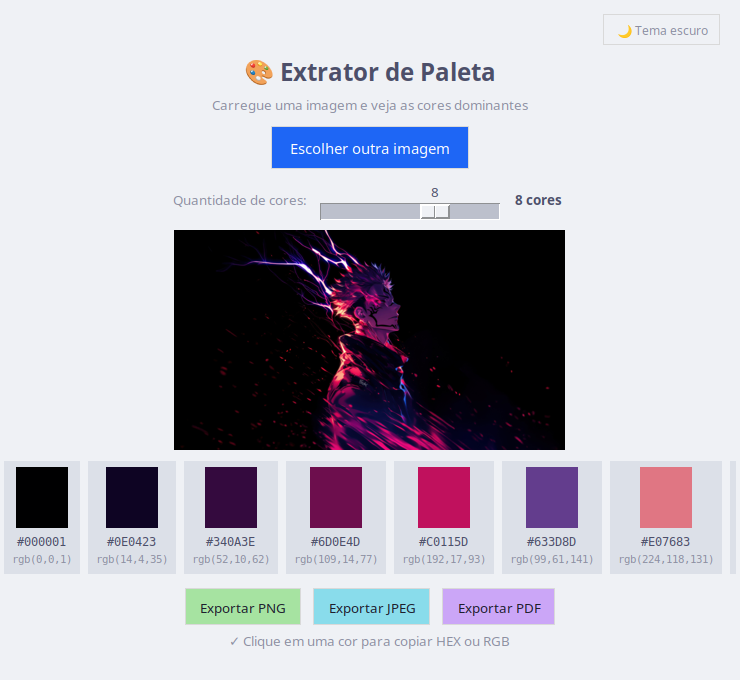

# 🎨 Paleta de Cores

Extrator de paleta de cores com interface gráfica feita em Python. Carregue qualquer imagem e veja as cores dominantes com seus códigos HEX e RGB.


---

## ✨ Funcionalidades

- Extrai de 4 a 10 cores dominantes de qualquer imagem
- Exibe código **HEX** e **RGB** de cada cor
- Clique em uma cor para copiar HEX ou RGB para a área de transferência
- Slider para ajustar a quantidade de cores extraídas
- Tema **claro e escuro**
- Exporta a paleta junto com a imagem em **PNG**, **JPEG** ou **PDF**

---

## 📸 Preview





---

## 🚀 Como usar

### 1. Clone o repositório

```bash
git clone https://github.com/clericodigo/paleta-cores.git
cd paleta-cores
```

### 2. Crie o ambiente virtual e instale as dependências

```bash
python3 -m venv venv
source venv/bin/activate
pip install pillow scikit-learn numpy
```

> No Pop!_OS / Ubuntu, instale também o Tkinter:
> ```bash
> sudo apt install python3-tk -y
> ```

### 3. Execute

```bash
python3 paleta.py
```

---

## 🛠️ Tecnologias

| Biblioteca | Uso |
|---|---|
| `Tkinter` | Interface gráfica |
| `Pillow` | Leitura e exportação de imagens |
| `scikit-learn` | Algoritmo K-Means para extração de cores |
| `NumPy` | Processamento de pixels |

---

## 📁 Estrutura

```
paleta-cores/
├── paleta.py       # Código principal
└── README.md       # Documentação
```

---

## 📄 Licença

Este projeto está sob a licença MIT. Veja o arquivo [LICENSE](LICENSE) para mais detalhes.

---

Feito por [clericodigo](https://github.com/clericodigo) 🚀
